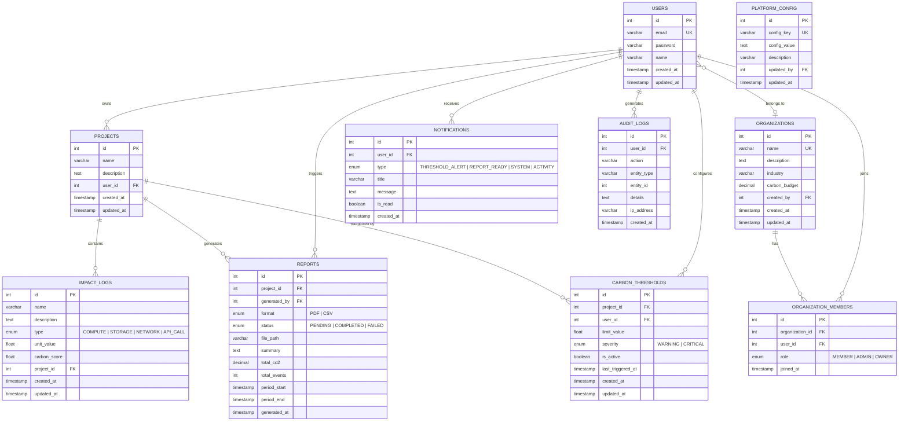

# ER Diagram — GreenPulse

## Overview

This Entity-Relationship diagram shows the database schema for the GreenPulse platform. **Implemented** entities are currently live in the codebase. **Planned** entities represent the future roadmap and are not yet implemented.

> [!NOTE]
> Entities marked with `🔜 Planned` are part of the architectural vision described in `idea.md` and will be implemented in future milestones.

---

---

## Table Summary

| Status | Table | Description | Key Relationships |
|--------|-------|-------------|-------------------|
| ✅ | `USERS` | All platform users authenticated via JWT | → Projects |
| ✅ | `PROJECTS` | Carbon tracking boundaries (apps, services) | ← User (owner), → Impact Logs |
| ✅ | `IMPACT_LOGS` | Individual infrastructure events with carbon scores | ← Project |
| 🔜 | `ORGANIZATIONS` | Multi-tenant groups for enterprise carbon tracking | → Org Members, ← Users |
| 🔜 | `ORGANIZATION_MEMBERS` | Junction table for organization membership | ← Organization, ← User |
| 🔜 | `REPORTS` | Generated compliance reports (PDF/CSV) | ← Project, ← User |
| 🔜 | `NOTIFICATIONS` | In-app notifications for alerts and system events | ← User |
| 🔜 | `CARBON_THRESHOLDS` | User-defined CO2 limits per project | ← Project, ← User |
| 🔜 | `AUDIT_LOGS` | Tamper-proof action log for compliance | ← User |
| 🔜 | `PLATFORM_CONFIG` | System-wide configuration key-value pairs | ← User (admin) |

---

## Key Indexes

| Table | Index | Purpose |
|-------|-------|---------| 
| `USERS` | `(email)` | Fast login lookups, duplicate prevention |
| `PROJECTS` | `(user_id)` | List all projects owned by a user |
| `IMPACT_LOGS` | `(project_id)` | Fast retrieval of all events for a project |
| `IMPACT_LOGS` | `(type)` | Filter events by impact type |
| `IMPACT_LOGS` | `(created_at)` | Time-series queries and sorting |
| `REPORTS` | `(project_id, generated_at)` | Recent reports for a project |
| `NOTIFICATIONS` | `(user_id, is_read)` | Unread notification count |
| `AUDIT_LOGS` | `(entity_type, entity_id)` | Entity-specific audit trail lookup |
| `CARBON_THRESHOLDS` | `(project_id, is_active)` | Active thresholds for monitoring |
