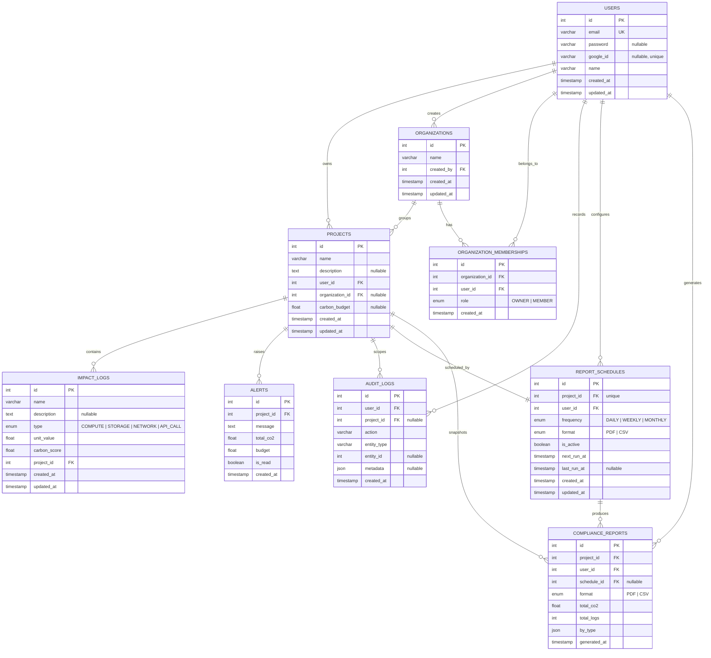

# ER Diagram - GreenPulse

This ER diagram is aligned with the current Prisma schema in `backend/prisma/schema.prisma`.

```mermaid
erDiagram
    USERS {
        int id PK
        varchar email UK
        varchar password "nullable"
        varchar google_id "nullable, unique"
        varchar name
        timestamp created_at
        timestamp updated_at
    }

    PROJECTS {
        int id PK
        varchar name
        text description "nullable"
        int user_id FK
        int organization_id FK "nullable"
        float carbon_budget "nullable"
        timestamp created_at
        timestamp updated_at
    }

    ORGANIZATIONS {
        int id PK
        varchar name
        int created_by FK
        timestamp created_at
        timestamp updated_at
    }

    ORGANIZATION_MEMBERSHIPS {
        int id PK
        int organization_id FK
        int user_id FK
        enum role "OWNER | MEMBER"
        timestamp created_at
    }

    IMPACT_LOGS {
        int id PK
        varchar name
        text description "nullable"
        enum type "COMPUTE | STORAGE | NETWORK | API_CALL"
        float unit_value
        float carbon_score
        int project_id FK
        timestamp created_at
        timestamp updated_at
    }

    ALERTS {
        int id PK
        int project_id FK
        text message
        float total_co2
        float budget
        boolean is_read
        timestamp created_at
    }

    AUDIT_LOGS {
        int id PK
        int user_id FK
        int project_id FK "nullable"
        varchar action
        varchar entity_type
        int entity_id "nullable"
        json metadata "nullable"
        timestamp created_at
    }

    REPORT_SCHEDULES {
        int id PK
        int project_id FK "unique"
        int user_id FK
        enum frequency "DAILY | WEEKLY | MONTHLY"
        enum format "PDF | CSV"
        boolean is_active
        timestamp next_run_at
        timestamp last_run_at "nullable"
        timestamp created_at
        timestamp updated_at
    }

    COMPLIANCE_REPORTS {
        int id PK
        int project_id FK
        int user_id FK
        int schedule_id FK "nullable"
        enum format "PDF | CSV"
        float total_co2
        int total_logs
        json by_type
        timestamp generated_at
    }

    USERS ||--o{ PROJECTS : owns
    PROJECTS ||--o{ IMPACT_LOGS : contains
    PROJECTS ||--o{ ALERTS : raises
    ORGANIZATIONS ||--o{ PROJECTS : groups
    USERS ||--o{ ORGANIZATIONS : creates
    ORGANIZATIONS ||--o{ ORGANIZATION_MEMBERSHIPS : has
    USERS ||--o{ ORGANIZATION_MEMBERSHIPS : belongs_to
    USERS ||--o{ AUDIT_LOGS : records
    PROJECTS ||--o{ AUDIT_LOGS : scopes
    USERS ||--o{ REPORT_SCHEDULES : configures
    PROJECTS ||--|| REPORT_SCHEDULES : scheduled_by
    USERS ||--o{ COMPLIANCE_REPORTS : generates
    PROJECTS ||--o{ COMPLIANCE_REPORTS : snapshots
    REPORT_SCHEDULES ||--o{ COMPLIANCE_REPORTS : produces
```

## Table Summary

| Table | Purpose | Notes |
|---|---|---|
| `users` | Account identity and auth source | `password` is nullable for Google-only accounts |
| `projects` | Carbon tracking scope per user | Optional `carbonBudget` threshold |
| `organizations` | Team workspace boundary | Creator-owned collaborative scope |
| `organization_memberships` | User membership in organizations | Role-based membership rows |
| `impact_logs` | Raw impact events + calculated CO2 | Belongs to one project |
| `alerts` | Threshold exceedance records | Created when total CO2 crosses budget |
| `audit_logs` | Compliance trace of key mutations | Links actor user and optional project scope |
| `report_schedules` | Recurring report configuration per project | One schedule per project |
| `compliance_reports` | Generated compliance snapshots | Optional link to originating schedule |

## Key Constraints

- `users.email` is unique.
- `users.googleId` is unique and nullable.
- `projects.userId` references `users.id` with `onDelete: Cascade`.
- `projects.organizationId` references `organizations.id` with `onDelete: SetNull`.
- `organizations.createdBy` references `users.id` with `onDelete: Cascade`.
- `organization_memberships.organizationId` references `organizations.id` with `onDelete: Cascade`.
- `organization_memberships.userId` references `users.id` with `onDelete: Cascade`.
- `impact_logs.projectId` references `projects.id` with `onDelete: Cascade`.
- `alerts.projectId` references `projects.id` with `onDelete: Cascade`.
- `audit_logs.userId` references `users.id` with `onDelete: Cascade`.
- `audit_logs.projectId` references `projects.id` with `onDelete: SetNull`.
- `report_schedules.projectId` references `projects.id` with `onDelete: Cascade` and is unique.
- `report_schedules.userId` references `users.id` with `onDelete: Cascade`.
- `compliance_reports.projectId` references `projects.id` with `onDelete: Cascade`.
- `compliance_reports.userId` references `users.id` with `onDelete: Cascade`.
- `compliance_reports.scheduleId` references `report_schedules.id` with `onDelete: SetNull`.

## Key Indexes

| Table | Index |
|---|---|
| `projects` | `(userId)`, `(organizationId)` |
| `organizations` | `(createdBy)` |
| `organization_memberships` | `(organizationId, userId unique)`, `(organizationId)`, `(userId)` |
| `impact_logs` | `(projectId)`, `(type)`, `(createdAt)` |
| `alerts` | `(projectId)`, `(createdAt)` |
| `audit_logs` | `(userId)`, `(projectId)`, `(createdAt)`, `(action)` |
| `report_schedules` | `(projectId unique)`, `(userId)`, `(isActive, nextRunAt)` |
| `compliance_reports` | `(projectId)`, `(scheduleId)`, `(generatedAt)` |

## Planned Data Model Extensions

Not yet implemented, but expected future additions include:

- organization and membership tables
- role and permission tables for RBAC
- cloud-ingestion and usage-normalization tables
