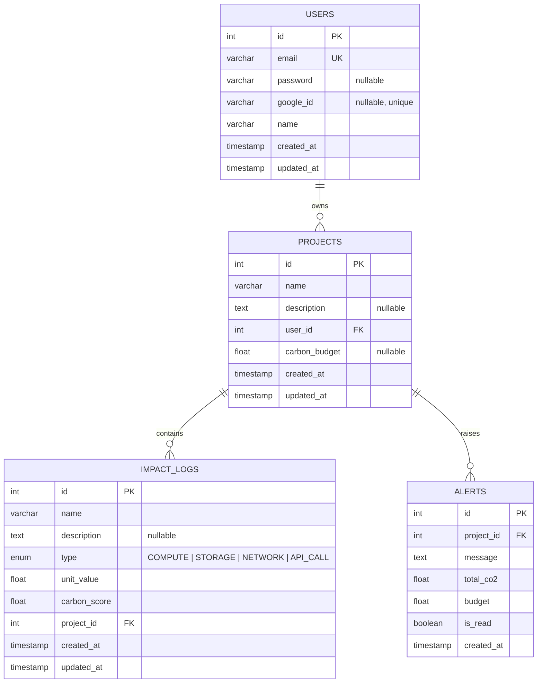

# ER Diagram - GreenPulse

This ER diagram is aligned with the current Prisma schema in `backend/prisma/schema.prisma`.

```mermaid
erDiagram
    USERS {
        int id PK
        varchar email UK
        varchar password "nullable"
        varchar google_id "nullable, unique"
        varchar name
        timestamp created_at
        timestamp updated_at
    }

    PROJECTS {
        int id PK
        varchar name
        text description "nullable"
        int user_id FK
        float carbon_budget "nullable"
        timestamp created_at
        timestamp updated_at
    }

    IMPACT_LOGS {
        int id PK
        varchar name
        text description "nullable"
        enum type "COMPUTE | STORAGE | NETWORK | API_CALL"
        float unit_value
        float carbon_score
        int project_id FK
        timestamp created_at
        timestamp updated_at
    }

    ALERTS {
        int id PK
        int project_id FK
        text message
        float total_co2
        float budget
        boolean is_read
        timestamp created_at
    }

    USERS ||--o{ PROJECTS : owns
    PROJECTS ||--o{ IMPACT_LOGS : contains
    PROJECTS ||--o{ ALERTS : raises
```

## Table Summary

| Table | Purpose | Notes |
|---|---|---|
| `users` | Account identity and auth source | `password` is nullable for Google-only accounts |
| `projects` | Carbon tracking scope per user | Optional `carbonBudget` threshold |
| `impact_logs` | Raw impact events + calculated CO2 | Belongs to one project |
| `alerts` | Threshold exceedance records | Created when total CO2 crosses budget |

## Key Constraints

- `users.email` is unique.
- `users.googleId` is unique and nullable.
- `projects.userId` references `users.id` with `onDelete: Cascade`.
- `impact_logs.projectId` references `projects.id` with `onDelete: Cascade`.
- `alerts.projectId` references `projects.id` with `onDelete: Cascade`.

## Key Indexes

| Table | Index |
|---|---|
| `projects` | `(userId)` |
| `impact_logs` | `(projectId)`, `(type)`, `(createdAt)` |
| `alerts` | `(projectId)`, `(createdAt)` |

## Planned Data Model Extensions

Not yet implemented, but expected future additions include:

- organization and membership tables
- role and permission tables for RBAC
- audit log tables for traceability
