```mermaid
classDiagram
    direction TB

    %% ===== DOMAIN MODELS & DTOs =====

    class User {
        -id: int
        -email: string
        -password: string
        -role: UserRole
        -organizationId: int
        +getProfile(): UserProfile
        +updateProfile(dto: UpdateProfileDto): void
    }

    class Project {
        -id: int
        -name: string
        -description: string
        -userId: int
        +addImpactLog(log: ImpactLog): void
        +getSummary(): ProjectSummary
    }

    class ImpactLog {
        -id: int
        -name: string
        -type: ImpactType
        -unitValue: float
        -carbonScore: float
        -projectId: int
    }

    class ImpactType {
        <<enumeration>>
        COMPUTE
        STORAGE
        NETWORK
        API_CALL
    }

    class ImpactEvent {
        <<abstract>>
        #unitValue: float
        +calculateCO2(): float*
    }

    class ComputeEvent {
        +calculateCO2(): float
    }

    class StorageEvent {
        +calculateCO2(): float
    }

    class NetworkEvent {
        +calculateCO2(): float
    }

    class ApiCallEvent {
        +calculateCO2(): float
    }

    %% ===== SERVICE LAYER =====

    class ImpactService {
        -impactRepo: ImpactRepository
        -projectRepo: ProjectRepository
        -notificationService: NotificationService
        +createImpact(dto: CreateImpactDTO): ImpactLog
        +getAllImpacts(projectId: int): ImpactLog[]
        -calculateCO2(type: ImpactType, val: float): float
    }

    class ProjectService {
        -projectRepo: ProjectRepository
        +createProject(dto: CreateProjectDTO): Project
        +getProjectById(id: int): Project
    }

    class AuthService {
        -userRepo: UserRepository
        +register(dto: RegisterDTO): AuthResponse
        +login(dto: LoginDTO): AuthResponse
    }

    class ReportingService {
        -strategy: IReportStrategy
        +setStrategy(strategy: IReportStrategy): void
        +generateReport(projectId: int): ReportFile
    }

    class NotificationService {
        -observers: INotificationObserver[]
        +subscribe(obs: INotificationObserver): void
        +notify(event: AlertEvent): void
        +checkThreshold(projectId: int): void
    }

    %% ===== STRATEGY & OBSERVER INTERFACES =====

    class IReportStrategy {
        <<interface>>
        +generate(data: ReportData): ReportFile
    }

    class PdfReportStrategy {
        +generate(data: ReportData): ReportFile
    }

    class CsvReportStrategy {
        +generate(data: ReportData): ReportFile
    }

    class INotificationObserver {
        <<interface>>
        +onEvent(event: AlertEvent): void
    }

    class EmailNotificationObserver {
        +onEvent(event: AlertEvent): void
    }

    class InAppNotificationObserver {
        +onEvent(event: AlertEvent): void
    }

    %% ===== REPOSITORIES =====

    class ImpactRepository {
        +create(data: ImpactLog): ImpactLog
        +findByProjectId(id: int): ImpactLog[]
        +getSummary(id: int): Summary
    }

    class ProjectRepository {
        +create(data: Project): Project
        +findById(id: int): Project
        +findByUserId(id: int): Project[]
    }

    class UserRepository {
        +create(data: User): User
        +findByEmail(email: string): User
    }

    %% ===== RELATIONSHIPS =====

    User "1" --> "*" Project : owns
    Project "1" --> "*" ImpactLog : contains
    ImpactLog --> ImpactType
    
    ImpactEvent <|-- ComputeEvent : extends
    ImpactEvent <|-- StorageEvent : extends
    ImpactEvent <|-- NetworkEvent : extends
    ImpactEvent <|-- ApiCallEvent : extends
    
    ImpactService --> ImpactRepository
    ImpactService --> ImpactEvent : creates (Factory)
    ImpactService --> NotificationService
    
    ReportingService --> IReportStrategy
    IReportStrategy <|.. PdfReportStrategy : implements
    IReportStrategy <|.. CsvReportStrategy : implements
    
    NotificationService --> INotificationObserver
    INotificationObserver <|.. EmailNotificationObserver : implements
    INotificationObserver <|.. InAppNotificationObserver : implements
```

# Class Diagram — GreenPulse

## Overview

This class diagram shows the major classes, their attributes, methods, and relationships across the GreenPulse platform. The design follows **Clean Architecture** (Controller → Service → Repository) with strong **OOP principles** and **design patterns**.

---

---

## Design Patterns in the Class Diagram

| Pattern | Where Applied | Purpose |
|---------|---------------|---------|
| **Factory Method** | `ImpactService.calculateCO2()` | Creates `ImpactEvent` subclasses based on `ImpactType` |
| **Strategy** | `ReportingService` + `IReportStrategy` | Validates swapping report formats (PDF/CSV) at runtime |
| **Observer** | `NotificationService` | Decouples threshold checks from alert delivery mechanisms |
| **Repository** | `ImpactRepository`, `ProjectRepository` | Abstracts database operations (Prisma) from services |
| **Polymorphism** | `ImpactEvent` hierarchy | Objects behave differently (`calculateCO2`) based on their specific class |

## OOP Principles

| Principle | Application |
|-----------|-------------|
| **Encapsulation** | Services hide business logic; Repositories hide data access; Models satisfy SRP |
| **Abstraction** | Abstract base class `ImpactEvent` hides calculation details; Interfaces defined for Strategy/Observer |
| **Inheritance** | `ComputeEvent`, `StorageEvent`, etc. inherit from `ImpactEvent` |
| **Polymorphism** | Calculation engine executes the correct subclass method at runtime without `instanceof` checks |
