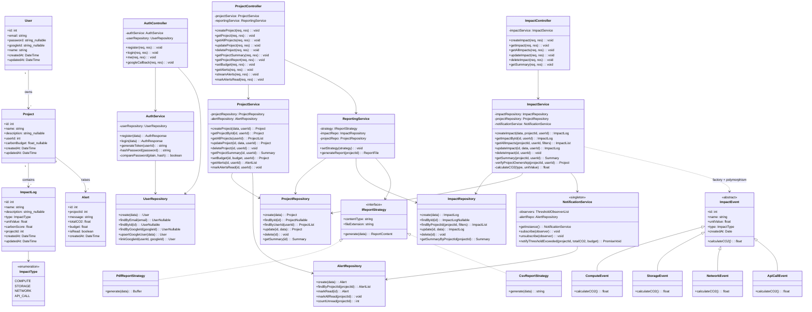

# Class Diagram - GreenPulse

This class diagram reflects the current implementation in `backend/src`.

```mermaid
classDiagram
    direction TB

    class User {
        +id: int
        +email: string
        +password: string_nullable
        +googleId: string_nullable
        +name: string
        +createdAt: DateTime
        +updatedAt: DateTime
    }

    class Project {
        +id: int
        +name: string
        +description: string_nullable
        +userId: int
        +carbonBudget: float_nullable
        +createdAt: DateTime
        +updatedAt: DateTime
    }

    class ImpactLog {
        +id: int
        +name: string
        +description: string_nullable
        +type: ImpactType
        +unitValue: float
        +carbonScore: float
        +projectId: int
        +createdAt: DateTime
        +updatedAt: DateTime
    }

    class Alert {
        +id: int
        +projectId: int
        +message: string
        +totalCO2: float
        +budget: float
        +isRead: boolean
        +createdAt: DateTime
    }

    class ImpactType {
        <<enumeration>>
        COMPUTE
        STORAGE
        NETWORK
        API_CALL
    }

    class ImpactEvent {
        <<abstract>>
        +id: int
        +name: string
        +unitValue: float
        +type: ImpactType
        +createdAt: Date
        +calculateCO2(): float*
    }

    class ComputeEvent {
        +calculateCO2(): float
    }

    class StorageEvent {
        +calculateCO2(): float
    }

    class NetworkEvent {
        +calculateCO2(): float
    }

    class ApiCallEvent {
        +calculateCO2(): float
    }

    class AuthController {
        -authService: AuthService
        -userRepository: UserRepository
        +register(req, res): void
        +login(req, res): void
        +me(req, res): void
        +googleCallback(req, res): void
    }

    class ProjectController {
        -projectService: ProjectService
        -reportingService: ReportingService
        +createProject(req, res): void
        +getProject(req, res): void
        +getAllProjects(req, res): void
        +updateProject(req, res): void
        +deleteProject(req, res): void
        +getProjectSummary(req, res): void
        +getProjectReport(req, res): void
        +setBudget(req, res): void
        +getAlerts(req, res): void
        +streamAlerts(req, res): void
        +markAlertsRead(req, res): void
    }

    class ImpactController {
        -impactService: ImpactService
        +createImpact(req, res): void
        +getImpact(req, res): void
        +getAllImpacts(req, res): void
        +updateImpact(req, res): void
        +deleteImpact(req, res): void
        +getSummary(req, res): void
    }

    class AuthService {
        -userRepository: UserRepository
        +register(data): AuthResponse
        +login(data): AuthResponse
        +generateToken(userId): string
        -hashPassword(password): string
        -comparePassword(plain, hash): boolean
    }

    class ProjectService {
        -projectRepository: ProjectRepository
        -alertRepository: AlertRepository
        +createProject(data, userId): Project
        +getProjectById(id, userId): Project
        +getAllProjects(userId): ProjectList
        +updateProject(id, data, userId): Project
        +deleteProject(id, userId): void
        +getProjectSummary(id, userId): Summary
        +setBudget(id, budget, userId): Project
        +getAlerts(id, userId): AlertList
        +markAlertsRead(id, userId): void
    }

    class ImpactService {
        -impactRepository: ImpactRepository
        -projectRepository: ProjectRepository
        -notificationService: NotificationService
        +createImpact(data, projectId, userId): ImpactLog
        +getImpactById(id, userId): ImpactLog
        +getAllImpacts(projectId, userId, filters): ImpactList
        +updateImpact(id, data, userId): ImpactLog
        +deleteImpact(id, userId): void
        +getSummary(projectId, userId): Summary
        -verifyProjectOwnership(projectId, userId): Project
        -calculateCO2(type, unitValue): float
    }

    class NotificationService {
        <<singleton>>
        -observers: ThresholdObserverList
        -alertRepo: AlertRepository
        +getInstance(): NotificationService
        +subscribe(observer): void
        +unsubscribe(observer): void
        +notifyThresholdExceeded(projectId, totalCO2, budget): PromiseVoid
    }

    class ReportingService {
        -strategy: IReportStrategy
        -impactRepo: ImpactRepository
        -projectRepo: ProjectRepository
        +setStrategy(strategy): void
        +generateReport(projectId): ReportFile
    }

    class IReportStrategy {
        <<interface>>
        +generate(data): ReportContent
        +contentType: string
        +fileExtension: string
    }

    class PdfReportStrategy {
        +generate(data): Buffer
    }

    class CsvReportStrategy {
        +generate(data): string
    }

    class UserRepository {
        +create(data): User
        +findByEmail(email): UserNullable
        +findById(id): UserNullable
        +findByGoogleId(googleId): UserNullable
        +upsertGoogleUser(data): User
        +linkGoogleId(userId, googleId): User
    }

    class ProjectRepository {
        +create(data): Project
        +findById(id): ProjectNullable
        +findByUserId(userId): ProjectList
        +update(id, data): Project
        +delete(id): void
        +getSummary(id): Summary
    }

    class ImpactRepository {
        +create(data): ImpactLog
        +findById(id): ImpactLogNullable
        +findByProjectId(projectId, filters): ImpactList
        +update(id, data): ImpactLog
        +delete(id): void
        +getSummaryByProjectId(projectId): Summary
    }

    class AlertRepository {
        +create(data): Alert
        +findByProjectId(projectId): AlertList
        +markRead(id): Alert
        +markAllRead(projectId): void
        +countUnread(projectId): int
    }

    User "1" --> "*" Project : owns
    Project "1" --> "*" ImpactLog : contains
    Project "1" --> "*" Alert : raises
    ImpactLog --> ImpactType

    ImpactEvent <|-- ComputeEvent
    ImpactEvent <|-- StorageEvent
    ImpactEvent <|-- NetworkEvent
    ImpactEvent <|-- ApiCallEvent

    AuthController --> AuthService
    AuthController --> UserRepository
    ProjectController --> ProjectService
    ProjectController --> ReportingService
    ImpactController --> ImpactService

    AuthService --> UserRepository
    ProjectService --> ProjectRepository
    ProjectService --> AlertRepository
    ImpactService --> ImpactRepository
    ImpactService --> ProjectRepository
    ImpactService --> NotificationService
    ImpactService ..> ImpactEvent : factory + polymorphism

    NotificationService --> AlertRepository
    ReportingService --> ProjectRepository
    ReportingService --> ImpactRepository
    ReportingService --> IReportStrategy
    IReportStrategy <|.. PdfReportStrategy
    IReportStrategy <|.. CsvReportStrategy
```

## Pattern Mapping

| Pattern | Location | Purpose |
|---|---|---|
| Factory Method | `ImpactService.calculateCO2()` | Chooses event subclass from `ImpactType` |
| Polymorphism | `ImpactEvent` hierarchy | Type-specific emission formulas |
| Strategy | `ReportingService` + report strategies | Runtime selection of PDF/CSV generation |
| Observer (lightweight) | `NotificationService` | Threshold notification fan-out + durable alert record |
| Repository | `*.repository.ts` classes | Database abstraction over Prisma |

## Planned Extensions (Not Implemented Yet)

- Organization and team domain classes
- Role/permission classes for RBAC
- Additional notification channels (email/websocket/webhook)
