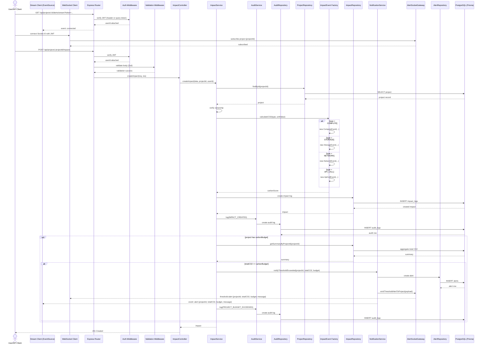
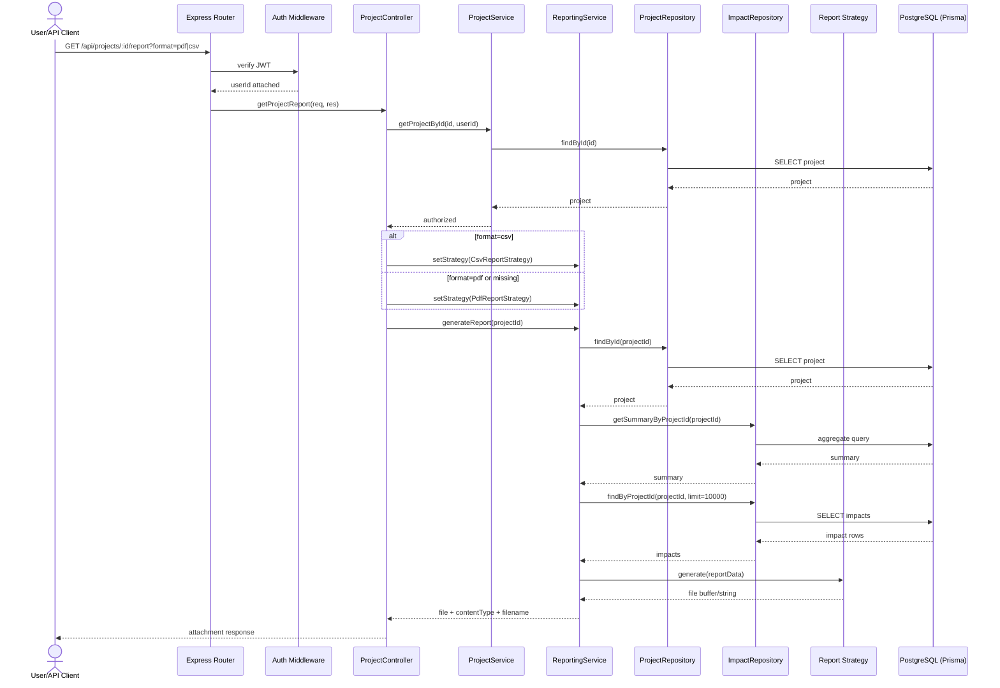
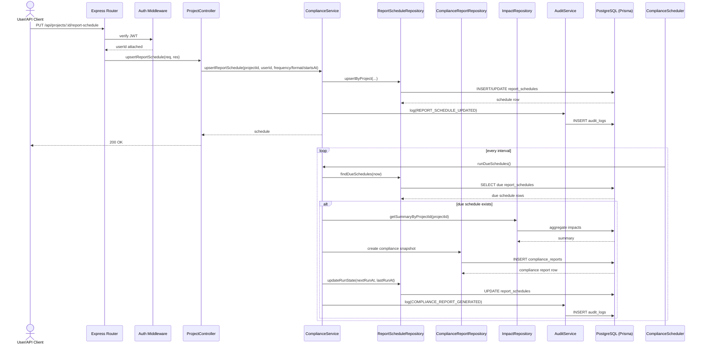

# Sequence Diagrams - GreenPulse

## Overview

This document shows the key request flows through the GreenPulse backend. Each diagram traces the full call chain from HTTP client through middleware, controller, service, and repository layers.

## Flow Summary

| Phase | Description | Key Patterns Used |
|---|---|---|
| 1. Impact Logging | User submits an impact event. Auth and validation middleware run first, then the service delegates to a factory that selects the correct `ImpactEvent` subclass and calculates CO2. The log is persisted and an audit entry is written. | Factory Method, Polymorphism, Repository |
| 2. Threshold Alert | After each impact write, the service checks total CO2 against the project budget. If exceeded, `NotificationService` persists an `Alert` record and fans the payload out to all subscribed WebSocket and SSE clients simultaneously. | Observer, Pub/Sub Gateway |
| 3. Report Download | User requests a PDF or CSV export. `ProjectController` selects a report strategy at runtime and delegates to `ReportingService`, which fetches project and impact data then invokes the strategy to produce the file buffer. | Strategy Pattern, Repository |
| 4. Compliance Scheduling | User configures a recurring schedule (daily/weekly/monthly). The scheduler loop polls for due schedules, generates a compliance snapshot for each, updates the run-state, and appends an audit log entry. | Scheduling, Template Method, Repository |

## 1) Impact Logging and Threshold Alert Flow

```mermaid
sequenceDiagram
    actor U as User/API Client
    participant SC as Stream Client (EventSource)
    participant WS as WebSocket Client
    participant R as Express Router
    participant AM as Auth Middleware
    participant VM as Validation Middleware
    participant IC as ImpactController
    participant IS as ImpactService
    participant AUS as AuditService
    participant AUR as AuditRepository
    participant PR as ProjectRepository
    participant F as ImpactEvent Factory
    participant IR as ImpactRepository
    participant NS as NotificationService
    participant AG as AlertSocketGateway
    participant AR as AlertRepository
    participant DB as PostgreSQL (Prisma)

    U->>R: GET /api/projects/:id/alerts/stream?token=...
    R->>AM: verify JWT (header or query token)
    AM-->>R: userId attached
    R-->>SC: event: connected

    U->>WS: connect Socket.IO with JWT
    WS->>AG: subscribe-project {projectId}
    AG-->>WS: subscribed

    U->>R: POST /api/projects/:projectId/impacts
    R->>AM: verify JWT
    AM-->>R: userId attached
    R->>VM: validate body (Zod)
    VM-->>R: validation success
    R->>IC: createImpact(req, res)
    IC->>IS: createImpact(data, projectId, userId)

    IS->>PR: findById(projectId)
    PR->>DB: SELECT project
    DB-->>PR: project record
    PR-->>IS: project
    IS->>IS: verify ownership

    IS->>F: calculateCO2(type, unitValue)
    alt type = COMPUTE
        F->>F: new ComputeEvent(...)
    else type = STORAGE
        F->>F: new StorageEvent(...)
    else type = NETWORK
        F->>F: new NetworkEvent(...)
    else type = API_CALL
        F->>F: new ApiCallEvent(...)
    end
    F-->>IS: carbonScore

    IS->>IR: create impact log
    IR->>DB: INSERT impact_logs
    DB-->>IR: created impact
    IR-->>IS: impact

    IS->>AUS: log(IMPACT_CREATED)
    AUS->>AUR: create audit log
    AUR->>DB: INSERT audit_logs
    DB-->>AUR: audit row

    opt project has carbonBudget
        IS->>IR: getSummaryByProjectId(projectId)
        IR->>DB: aggregate total CO2
        DB-->>IR: summary
        IR-->>IS: summary

        alt totalCO2 >= carbonBudget
            IS->>NS: notifyThresholdExceeded(projectId, totalCO2, budget)
            NS->>AR: create alert
            AR->>DB: INSERT alerts
            DB-->>AR: alert row
            NS->>AG: emitThresholdAlertToProject(payload)
            AG-->>WS: threshold-alert {projectId, totalCO2, budget, message}
            NS-->>SC: event: alert {projectId, totalCO2, budget, message}
            IS->>AUS: log(PROJECT_BUDGET_EXCEEDED)
            AUS->>AUR: create audit log
            AUR->>DB: INSERT audit_logs
        end
    end

    IS-->>IC: impact
    IC-->>U: 201 Created
```

## 2) Report Download Flow (Strategy Selection)

```mermaid
sequenceDiagram
    actor U as User/API Client
    participant R as Express Router
    participant AM as Auth Middleware
    participant PC as ProjectController
    participant PS as ProjectService
    participant RS as ReportingService
    participant PR as ProjectRepository
    participant IR as ImpactRepository
    participant S as Report Strategy
    participant DB as PostgreSQL (Prisma)

    U->>R: GET /api/projects/:id/report?format=pdf|csv
    R->>AM: verify JWT
    AM-->>R: userId attached
    R->>PC: getProjectReport(req, res)

    PC->>PS: getProjectById(id, userId)
    PS->>PR: findById(id)
    PR->>DB: SELECT project
    DB-->>PR: project
    PR-->>PS: project
    PS-->>PC: authorized

    alt format=csv
        PC->>RS: setStrategy(CsvReportStrategy)
    else format=pdf or missing
        PC->>RS: setStrategy(PdfReportStrategy)
    end

    PC->>RS: generateReport(projectId)
    RS->>PR: findById(projectId)
    PR->>DB: SELECT project
    DB-->>PR: project
    PR-->>RS: project

    RS->>IR: getSummaryByProjectId(projectId)
    IR->>DB: aggregate query
    DB-->>IR: summary
    IR-->>RS: summary

    RS->>IR: findByProjectId(projectId, limit=10000)
    IR->>DB: SELECT impacts
    DB-->>IR: impact rows
    IR-->>RS: impacts

    RS->>S: generate(reportData)
    S-->>RS: file buffer/string
    RS-->>PC: file + contentType + filename
    PC-->>U: attachment response
```

## 3) Recurring Compliance Report Schedule and Auto-Generation

```mermaid
sequenceDiagram
    actor U as User/API Client
    participant R as Express Router
    participant AM as Auth Middleware
    participant PC as ProjectController
    participant CS as ComplianceService
    participant PSR as ReportScheduleRepository
    participant CRR as ComplianceReportRepository
    participant IR as ImpactRepository
    participant AUS as AuditService
    participant DB as PostgreSQL (Prisma)
    participant SCH as ComplianceScheduler

    U->>R: PUT /api/projects/:id/report-schedule
    R->>AM: verify JWT
    AM-->>R: userId attached
    R->>PC: upsertReportSchedule(req, res)
    PC->>CS: upsertReportSchedule(projectId, userId, frequency/format/startsAt)
    CS->>PSR: upsertByProject(...)
    PSR->>DB: INSERT/UPDATE report_schedules
    DB-->>PSR: schedule row
    CS->>AUS: log(REPORT_SCHEDULE_UPDATED)
    AUS->>DB: INSERT audit_logs
    CS-->>PC: schedule
    PC-->>U: 200 OK

    loop every interval
        SCH->>CS: runDueSchedules()
        CS->>PSR: findDueSchedules(now)
        PSR->>DB: SELECT due report_schedules
        DB-->>PSR: due schedule rows

        alt due schedule exists
            CS->>IR: getSummaryByProjectId(projectId)
            IR->>DB: aggregate impacts
            DB-->>IR: summary
            CS->>CRR: create compliance snapshot
            CRR->>DB: INSERT compliance_reports
            DB-->>CRR: compliance report row
            CS->>PSR: updateRunState(nextRunAt, lastRunAt)
            PSR->>DB: UPDATE report_schedules
            CS->>AUS: log(COMPLIANCE_REPORT_GENERATED)
            AUS->>DB: INSERT audit_logs
        end
    end
```
