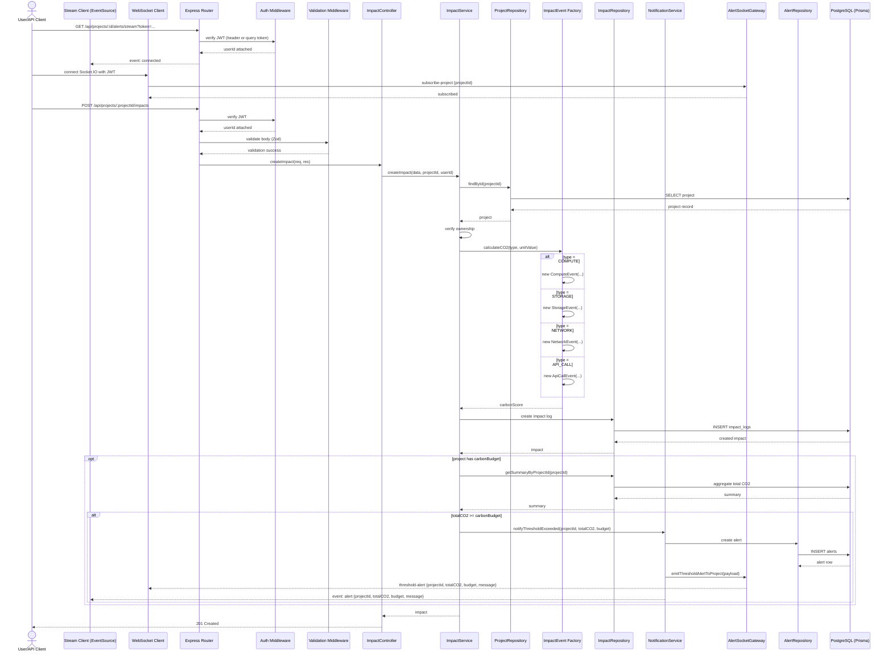
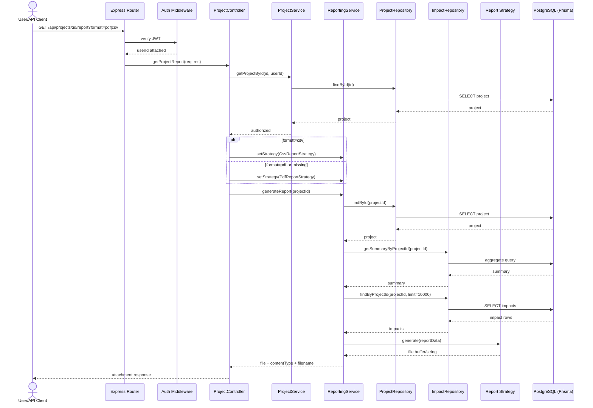

# Sequence Diagrams - GreenPulse

## 1) Impact Logging and Threshold Alert Flow

```mermaid
sequenceDiagram
    actor U as User/API Client
    participant SC as Stream Client (EventSource)
    participant WS as WebSocket Client
    participant R as Express Router
    participant AM as Auth Middleware
    participant VM as Validation Middleware
    participant IC as ImpactController
    participant IS as ImpactService
    participant PR as ProjectRepository
    participant F as ImpactEvent Factory
    participant IR as ImpactRepository
    participant NS as NotificationService
    participant AG as AlertSocketGateway
    participant AR as AlertRepository
    participant DB as PostgreSQL (Prisma)

    U->>R: GET /api/projects/:id/alerts/stream?token=...
    R->>AM: verify JWT (header or query token)
    AM-->>R: userId attached
    R-->>SC: event: connected

    U->>WS: connect Socket.IO with JWT
    WS->>AG: subscribe-project {projectId}
    AG-->>WS: subscribed

    U->>R: POST /api/projects/:projectId/impacts
    R->>AM: verify JWT
    AM-->>R: userId attached
    R->>VM: validate body (Zod)
    VM-->>R: validation success
    R->>IC: createImpact(req, res)
    IC->>IS: createImpact(data, projectId, userId)

    IS->>PR: findById(projectId)
    PR->>DB: SELECT project
    DB-->>PR: project record
    PR-->>IS: project
    IS->>IS: verify ownership

    IS->>F: calculateCO2(type, unitValue)
    alt type = COMPUTE
        F->>F: new ComputeEvent(...)
    else type = STORAGE
        F->>F: new StorageEvent(...)
    else type = NETWORK
        F->>F: new NetworkEvent(...)
    else type = API_CALL
        F->>F: new ApiCallEvent(...)
    end
    F-->>IS: carbonScore

    IS->>IR: create impact log
    IR->>DB: INSERT impact_logs
    DB-->>IR: created impact
    IR-->>IS: impact

    opt project has carbonBudget
        IS->>IR: getSummaryByProjectId(projectId)
        IR->>DB: aggregate total CO2
        DB-->>IR: summary
        IR-->>IS: summary

        alt totalCO2 >= carbonBudget
            IS->>NS: notifyThresholdExceeded(projectId, totalCO2, budget)
            NS->>AR: create alert
            AR->>DB: INSERT alerts
            DB-->>AR: alert row
            NS->>AG: emitThresholdAlertToProject(payload)
            AG-->>WS: threshold-alert {projectId, totalCO2, budget, message}
            NS-->>SC: event: alert {projectId, totalCO2, budget, message}
        end
    end

    IS-->>IC: impact
    IC-->>U: 201 Created
```

## 2) Report Download Flow (Strategy Selection)

```mermaid
sequenceDiagram
    actor U as User/API Client
    participant R as Express Router
    participant AM as Auth Middleware
    participant PC as ProjectController
    participant PS as ProjectService
    participant RS as ReportingService
    participant PR as ProjectRepository
    participant IR as ImpactRepository
    participant S as Report Strategy
    participant DB as PostgreSQL (Prisma)

    U->>R: GET /api/projects/:id/report?format=pdf|csv
    R->>AM: verify JWT
    AM-->>R: userId attached
    R->>PC: getProjectReport(req, res)

    PC->>PS: getProjectById(id, userId)
    PS->>PR: findById(id)
    PR->>DB: SELECT project
    DB-->>PR: project
    PR-->>PS: project
    PS-->>PC: authorized

    alt format=csv
        PC->>RS: setStrategy(CsvReportStrategy)
    else format=pdf or missing
        PC->>RS: setStrategy(PdfReportStrategy)
    end

    PC->>RS: generateReport(projectId)
    RS->>PR: findById(projectId)
    PR->>DB: SELECT project
    DB-->>PR: project
    PR-->>RS: project

    RS->>IR: getSummaryByProjectId(projectId)
    IR->>DB: aggregate query
    DB-->>IR: summary
    IR-->>RS: summary

    RS->>IR: findByProjectId(projectId, limit=10000)
    IR->>DB: SELECT impacts
    DB-->>IR: impact rows
    IR-->>RS: impacts

    RS->>S: generate(reportData)
    S-->>RS: file buffer/string
    RS-->>PC: file + contentType + filename
    PC-->>U: attachment response
```
