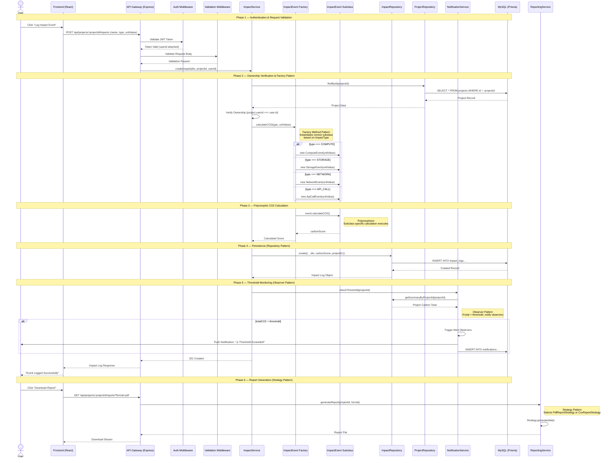

# Sequence Diagram — GreenPulse

## Main Flow: End-to-End Impact Event Logging (User Logs Event → Factory Creates Subclass → Polymorphic CO2 Calculation → Notification)

This sequence diagram illustrates the complete lifecycle of an infrastructure impact event — from a user logging the event, through factory-based instantiation, polymorphic calculation, and repository persistence, to threshold evaluation and notification.

---

---

## Flow Summary

| Phase | Description | Key Patterns Used |
|-------|-------------|-------------------|
| **1. Auth & Validation** | JWT token validation and request body schema validation via middleware pipeline. | Chain of Responsibility |
| **2. Factory Pattern** | `ImpactType` determines which `ImpactEvent` subclass (`ComputeEvent`, etc.) is instantiated. | Factory Method |
| **3. Polymorphism** | `calculateCO2()` is called on the specific subclass instance to compute emissions. | Polymorphism, Abstraction |
| **4. Persistence** | Data access is abstracted via Repository, keeping business logic clean. | Repository Pattern |
| **5. Monitoring** | Thresholds are checked after every write; alerts are dispatched if limits are breached. | Observer Pattern |
| **6. Reporting** | Report generation algorithm is selected at runtime based on the requested format. | Strategy Pattern |
