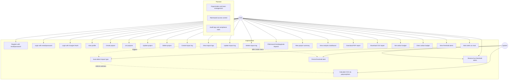

# Use Case Diagram - GreenPulse

Use cases marked `Implemented` are available now. `Planned` items are future roadmap goals.

```mermaid
graph TB
    User((User))
    System((System))

    subgraph Implemented
        UC1[Register with email/password]
        UC2[Login with email/password]
        UC3[Login with Google OAuth]
        UC4[View profile]
        UC5[Create project]
        UC6[List projects]
        UC7[Update project]
        UC8[Delete project]
        UC9[Create impact log]
        UC10[View impact logs]
        UC11[Update impact log]
        UC12[Delete impact log]
        UC13[Filter/search/sort/paginate impacts]
        UC14[View project summary]
        UC15[View analytics dashboard]
        UC16[Download PDF report]
        UC17[Download CSV report]
        UC18[Set carbon budget]
        UC19[Clear carbon budget]
        UC20[View threshold alerts]
        UC21[Mark alerts as read]
        UC22[Auto-detect impact type]
        UC23[Calculate CO2 via polymorphism]
        UC24[Persist threshold alert]
        UC27[Receive live threshold alerts]
    end

    subgraph Planned
        UC25[Organization and team management]
        UC26[Role-based access control]
        UC28[Audit logs and compliance tools]
    end

    User --> UC1
    User --> UC2
    User --> UC3
    User --> UC4
    User --> UC5
    User --> UC6
    User --> UC7
    User --> UC8
    User --> UC9
    User --> UC10
    User --> UC11
    User --> UC12
    User --> UC13
    User --> UC14
    User --> UC15
    User --> UC16
    User --> UC17
    User --> UC18
    User --> UC19
    User --> UC20
    User --> UC21
    User --> UC27

    System --> UC22
    System --> UC23
    System --> UC24
    System --> UC27

    UC9 -. triggers .-> UC22
    UC22 -. selects subclass .-> UC23
    UC9 -. after create check .-> UC24
```

## Use Case Status Table

| ID | Use Case | Actor | Status |
|---|---|---|---|
| UC1 | Register with email/password | User | Implemented |
| UC2 | Login with email/password | User | Implemented |
| UC3 | Login with Google OAuth | User | Implemented |
| UC4 | View profile | User | Implemented |
| UC5 | Create project | User | Implemented |
| UC6 | List projects | User | Implemented |
| UC7 | Update project | User | Implemented |
| UC8 | Delete project | User | Implemented |
| UC9 | Create impact log | User | Implemented |
| UC10 | View impact logs | User | Implemented |
| UC11 | Update impact log | User | Implemented |
| UC12 | Delete impact log | User | Implemented |
| UC13 | Filter/search/sort/paginate impacts | User | Implemented |
| UC14 | View project summary | User | Implemented |
| UC15 | View analytics dashboard | User | Implemented |
| UC16 | Download PDF report | User | Implemented |
| UC17 | Download CSV report | User | Implemented |
| UC18 | Set carbon budget | User | Implemented |
| UC19 | Clear carbon budget | User | Implemented |
| UC20 | View threshold alerts | User | Implemented |
| UC21 | Mark alerts as read | User | Implemented |
| UC22 | Auto-detect impact type | System | Implemented |
| UC23 | Calculate CO2 via polymorphism | System | Implemented |
| UC24 | Persist threshold alert | System | Implemented |
| UC27 | Receive live threshold alerts | User/System | Implemented |
| UC25 | Organization and team management | User/Admin | Planned |
| UC26 | Role-based access control | Admin/System | Planned |
| UC28 | Audit logs and compliance tools | Admin | Planned |
