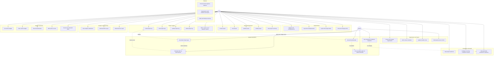

# Use Case Diagram - GreenPulse

## Overview

This diagram shows all major use cases for the GreenPulse platform, organized by the two primary actors: **User** (any authenticated team member) and **System** (automated backend processes). Use cases are grouped by functional area. Items marked `Planned` are future roadmap goals; all others are currently implemented.

```mermaid
graph TB
    User((User))
    System((System))

    subgraph Authentication
        UC1[Register with email/password]
        UC2[Login with email/password]
        UC3[Login with Google OAuth]
        UC4[View and manage profile]
    end

    subgraph Project Management
        UC5[Create project]
        UC6[List projects]
        UC7[Update project]
        UC8[Delete project]
        UC14[View project summary]
    end

    subgraph Impact Logging
        UC9[Create impact log]
        UC10[View impact logs]
        UC11[Update impact log]
        UC12[Delete impact log]
        UC13[Filter / search / sort / paginate impacts]
    end

    subgraph Analytics and Reporting
        UC15[View analytics dashboard]
        UC16[Download PDF report]
        UC17[Download CSV report]
    end

    subgraph Budgets and Alerts
        UC18[Set carbon budget]
        UC19[Clear carbon budget]
        UC20[View threshold alerts]
        UC21[Mark alerts as read]
        UC27[Receive live threshold alerts]
    end

    subgraph Organization and Teams
        UC25[Create and manage organization]
        UC25B[Add / remove members]
        UC25C[Update member roles]
        UC26[Role-based access control]
    end

    subgraph Compliance and Audit
        UC28[View project audit trail]
        UC30[Configure recurring compliance reports]
        UC31[View generated compliance snapshots]
    end

    subgraph System Automation
        UC22[Auto-detect impact type]
        UC23[Calculate CO2 via polymorphism]
        UC24[Persist threshold alert]
        UC32[Fan-out realtime alert via WebSocket/SSE]
        UC33[Run scheduled compliance snapshots]
    end

    subgraph Planned
        UC29[Cloud provider ingestion adapters]
        UC34[Organization audit retention and export]
        UC35[SSO and SCIM provisioning]
    end

    User --> UC1
    User --> UC2
    User --> UC3
    User --> UC4
    User --> UC5
    User --> UC6
    User --> UC7
    User --> UC8
    User --> UC9
    User --> UC10
    User --> UC11
    User --> UC12
    User --> UC13
    User --> UC14
    User --> UC15
    User --> UC16
    User --> UC17
    User --> UC18
    User --> UC19
    User --> UC20
    User --> UC21
    User --> UC27
    User --> UC28
    User --> UC30
    User --> UC31
    User --> UC25
    User --> UC25B
    User --> UC25C

    System --> UC22
    System --> UC23
    System --> UC24
    System --> UC26
    System --> UC32
    System --> UC33

    UC9 -. triggers .-> UC22
    UC22 -. selects subclass .-> UC23
    UC23 -. returns score .-> UC9
    UC9 -. after save: budget check .-> UC24
    UC24 -. if exceeded .-> UC32
    UC33 -. on schedule .-> UC31
```

## Use Case Descriptions

| # | Use Case | Actors | Description |
|---|---|---|---|
| UC1 | Register with email/password | User | Create a new account with email and hashed password. JWT issued on success. |
| UC2 | Login with email/password | User | Authenticate with credentials. Returns a signed JWT for subsequent requests. |
| UC3 | Login with Google OAuth | User | Initiate Google OAuth flow. Existing accounts with matching email are linked automatically. |
| UC4 | View and manage profile | User | View current user info returned from `/api/auth/me`. |
| UC5 | Create project | User | Create a new carbon tracking project scoped to the authenticated user or organization. |
| UC6 | List projects | User | Retrieve all projects accessible to the current user, including org-shared projects. |
| UC7 | Update project | User | Edit project name or description. Requires ownership or sufficient org role. |
| UC8 | Delete project | User | Remove a project and cascade-delete all impact logs and alerts. |
| UC9 | Create impact log | User | Log a new infrastructure emission event (`COMPUTE`, `STORAGE`, `NETWORK`, `API_CALL`). CO2 is calculated automatically. |
| UC10 | View impact logs | User | List all impact logs under a project with optional filters applied. |
| UC11 | Update impact log | User | Edit the name, description, type, or unit value of an existing impact log. CO2 is recalculated. |
| UC12 | Delete impact log | User | Remove a single impact log from a project. |
| UC13 | Filter / search / sort / paginate impacts | User | Apply `type`, `search`, `sortBy`, `sortOrder`, `page`, and `limit` query params against impact log listings. |
| UC14 | View project summary | User | Aggregate total CO2, count, and per-type breakdown for a project. |
| UC15 | View analytics dashboard | User | Cross-project emissions view with KPI cards, trend charts, and type breakdowns. |
| UC16 | Download PDF report | User | Export project impact data as a formatted PDF via `PdfReportStrategy`. |
| UC17 | Download CSV report | User | Export project impact data as a CSV via `CsvReportStrategy`. |
| UC18 | Set carbon budget | User | Assign a CO2 budget threshold to a project. Triggers alerts when exceeded. |
| UC19 | Clear carbon budget | User | Remove the budget threshold from a project. |
| UC20 | View threshold alerts | User | List all budget-exceedance alert records for a project. |
| UC21 | Mark alerts as read | User | Bulk-mark all unread alerts for a project as read. |
| UC22 | Auto-detect impact type | System | `ImpactService` reads the `type` field and selects the matching `ImpactEvent` subclass via the factory. |
| UC23 | Calculate CO2 via polymorphism | System | The selected `ImpactEvent` subclass runs its `calculateCO2()` method using the type-specific emission factor. |
| UC24 | Persist threshold alert | System | `NotificationService` writes an `Alert` row to the database when total CO2 crosses the project budget. |
| UC25 | Create and manage organization | User | Create a collaborative workspace to share projects across a team. |
| UC25B | Add / remove members | User | Add a user to an organization by email or remove an existing member. |
| UC25C | Update member roles | User | Promote or demote members between `OWNER`, `ADMIN`, and `MEMBER` roles (owner-safeguarded). |
| UC26 | Role-based access control | System | `RbacService` enforces role-to-permission gates for project management, budgets, compliance, and audit operations. |
| UC27 | Receive live threshold alerts | User / System | Clients subscribe to a Socket.IO room or SSE stream and receive `threshold-alert` events in real time when a budget is exceeded. |
| UC28 | View project audit trail | User / System | Retrieve a chronological log of key project and impact mutations produced by `AuditService`. |
| UC30 | Configure recurring compliance reports | User / System | Set a `DAILY`, `WEEKLY`, or `MONTHLY` report schedule with format preference for a project. |
| UC31 | View generated compliance snapshots | User / System | Browse the history of auto-generated compliance report records for a project. |
| UC32 | Fan-out realtime alert via WebSocket/SSE | System | `AlertSocketGateway` emits the alert payload to all Socket.IO room subscribers; `NotificationService` also pushes to active SSE connections. |
| UC33 | Run scheduled compliance snapshots | System | `complianceScheduler` polls for due schedules at regular intervals, generates snapshot data, persists a `ComplianceReport`, and updates the run-state. |
| UC29 | Cloud provider ingestion adapters | System | **Planned.** Direct ingestion of usage data from AWS, GCP, and Azure APIs. |
| UC34 | Organization audit retention and export | User / System | **Planned.** Org-level audit log governance, retention policies, and bulk export controls. |
| UC35 | SSO and SCIM provisioning | System | **Planned.** Enterprise identity provider integration for automated user and role provisioning. |
