```mermaid
graph TB
    subgraph GreenPulse Platform
        UC1["Register / Login"]
        UC2["Manage Profile"]
        UC3["Create Project"]
        UC4["View All Projects"]
        UC5["Update Project"]
        UC6["Delete Project"]
        UC7["Log Impact Event"]
        UC8["View Impact Events"]
        UC9["View Project Summary"]
        UC10["Filter & Search Impacts"]
        UC11["View Analytics Dashboard"]
        UC12["Generate PDF Report"]
        UC13["Export CSV Data"]
        UC14["Set Carbon Threshold Alert"]
        UC15["View Notifications"]
        UC16["Manage Organization"]
        UC17["Manage Team Members"]
        UC18["Manage Users"]
        UC19["View Audit Logs"]
        UC20["Configure Platform Settings"]
        UC21["View Organization Analytics"]
        UC22["Auto-Calculate Carbon Score"]
        UC23["Detect Impact Type"]
        UC24["Monitor Carbon Thresholds"]
        UC25["Send Threshold Alerts"]
        UC26["Schedule Report Generation"]
    end

    User((User))
    Admin((Admin))
    System((System))

    %% User use cases
    User --> UC1
    User --> UC2
    User --> UC3
    User --> UC4
    User --> UC5
    User --> UC6
    User --> UC7
    User --> UC8
    User --> UC9
    User --> UC10
    User --> UC11
    User --> UC12
    User --> UC13
    User --> UC14
    User --> UC15
    User --> UC16
    User --> UC17

    %% Admin use cases
    Admin --> UC1
    Admin --> UC18
    Admin --> UC19
    Admin --> UC20
    Admin --> UC21
    Admin --> UC11
    Admin --> UC12

    %% System-driven (internal)
    UC7 -.->|triggers| UC23
    UC23 -.->|polymorphic calc| UC22
    UC22 -.->|checks| UC24
    UC24 -.->|if exceeded| UC25
    UC11 -.->|triggers| UC26
```

# Use Case Diagram — GreenPulse

## Overview

This diagram shows all major use cases for the GreenPulse platform, organized by the three primary actors: **User**, **Admin**, and **System**.

---

---

## Use Case Descriptions

| # | Use Case | Actors | Description |
|---|----------|--------|-------------|
| UC1 | Register / Login | All | Create account or authenticate with JWT. Role assigned at registration. |
| UC2 | Manage Profile | User | Update personal info (name, email) and change password. |
| UC3 | Create Project | User | Define a new digital project (app, service) for carbon tracking. |
| UC4 | View All Projects | User | List all projects owned by the user with summary statistics. |
| UC5 | Update Project | User | Modify project metadata. Ownership verified before mutation. |
| UC6 | Delete Project | User | Remove a project and cascade delete all its impact logs. |
| UC7 | Log Impact Event | User | Record an infrastructure event (Compute, Storage, etc.). Score auto-calculated. |
| UC8 | View Impact Events | User | Browse history of logged events with pagination. |
| UC9 | View Project Summary | User | See aggregated carbon totals and breakdown by impact type. |
| UC10 | Filter & Search Impacts | User | Sort and filter logs by type, date, or keyword. |
| UC11 | View Analytics Dashboard | User, Admin | Real-time charts showing emission trends and milestones. |
| UC12 | Generate PDF Report | User, Admin | Download a formatted PDF compliance report (Strategy Pattern). |
| UC13 | Export CSV Data | User | Export raw impact data for external analysis. |
| UC14 | Set Carbon Threshold Alert | User | Configure CO2 limits per project. |
| UC15 | View Notifications | User | See alerts for thresholds, reports, and system messages. |
| UC16 | Manage Organization | User | Create or join a multi-tenant organization. |
| UC17 | Manage Team Members | User | Add or remove members from an organization. |
| UC18 | Manage Users | Admin | Create, update, or deactivate system users. |
| UC19 | View Audit Logs | Admin | Review immutable logs of all system actions. |
| UC20 | Configure Platform Settings | Admin | Update global emission factors and system configs. |
| UC21 | View Organization Analytics | Admin | Cross-project analytics for the entire organization. |
| UC22 | Auto-Calculate Carbon Score | System | Factory creates subclass -> Polymorphic calculation of CO2. |
| UC23 | Detect Impact Type | System | Identify event type to instantiate correct `ImpactEvent` subclass. |
| UC24 | Monitor Carbon Thresholds | System | Check project totals against limits after every write. |
| UC25 | Send Threshold Alerts | System | Notify users via Observer Pattern when limits are breached. |
| UC26 | Schedule Report Generation | System | Automated periodic report generation. |
