```mermaid
graph TB
    subgraph GreenPulse Platform
        UC1["✅ Register / Login"]
        UC2["🔜 Manage Profile"]
        UC3["✅ Create Project"]
        UC4["✅ View All Projects"]
        UC5["✅ Update Project"]
        UC6["✅ Delete Project"]
        UC7["✅ Log Impact Event"]
        UC8["✅ View Impact Events"]
        UC9["✅ View Project Summary"]
        UC10["✅ Filter & Search Impacts"]
        UC11["🔜 View Analytics Dashboard"]
        UC12["🔜 Generate PDF Report"]
        UC13["🔜 Export CSV Data"]
        UC14["🔜 Set Carbon Threshold Alert"]
        UC15["🔜 View Notifications"]
        UC16["🔜 Manage Organization"]
        UC17["🔜 Manage Team Members"]
        UC18["🔜 Manage Users"]
        UC19["🔜 View Audit Logs"]
        UC20["🔜 Configure Platform Settings"]
        UC21["🔜 View Organization Analytics"]
        UC22["✅ Auto-Calculate Carbon Score"]
        UC23["✅ Detect Impact Type"]
        UC24["🔜 Monitor Carbon Thresholds"]
        UC25["🔜 Send Threshold Alerts"]
        UC26["🔜 Schedule Report Generation"]
    end

    User((User))
    Admin((Admin))
    System((System))

    %% User use cases
    User --> UC1
    User --> UC2
    User --> UC3
    User --> UC4
    User --> UC5
    User --> UC6
    User --> UC7
    User --> UC8
    User --> UC9
    User --> UC10
    User --> UC11
    User --> UC12
    User --> UC13
    User --> UC14
    User --> UC15
    User --> UC16
    User --> UC17

    %% Admin use cases
    Admin --> UC1
    Admin --> UC18
    Admin --> UC19
    Admin --> UC20
    Admin --> UC21
    Admin --> UC11
    Admin --> UC12

    %% System-driven (internal)
    UC7 -.->|triggers| UC23
    UC23 -.->|polymorphic calc| UC22
    UC22 -.->|checks| UC24
    UC24 -.->|if exceeded| UC25
    UC11 -.->|triggers| UC26
```

# Use Case Diagram — GreenPulse

## Overview

This diagram shows all major use cases for the GreenPulse platform, organized by the three primary actors: **User**, **Admin**, and **System**.

> [!NOTE]
> Use cases marked with ✅ are currently implemented. Use cases marked with 🔜 are planned for future milestones.

---

---

## Use Case Descriptions

| # | Use Case | Actors | Status | Description |
|---|----------|--------|--------|-------------|
| UC1 | Register / Login | All | ✅ | Create account or authenticate with JWT. |
| UC2 | Manage Profile | User | 🔜 | Update personal info (name, email) and change password. |
| UC3 | Create Project | User | ✅ | Define a new digital project (app, service) for carbon tracking. |
| UC4 | View All Projects | User | ✅ | List all projects owned by the user with summary statistics. |
| UC5 | Update Project | User | ✅ | Modify project metadata. Ownership verified before mutation. |
| UC6 | Delete Project | User | ✅ | Remove a project and cascade delete all its impact logs. |
| UC7 | Log Impact Event | User | ✅ | Record an infrastructure event (Compute, Storage, etc.). Score auto-calculated. |
| UC8 | View Impact Events | User | ✅ | Browse history of logged events with pagination. |
| UC9 | View Project Summary | User | ✅ | See aggregated carbon totals and breakdown by impact type. |
| UC10 | Filter & Search Impacts | User | ✅ | Sort and filter logs by type, date, or keyword. |
| UC11 | View Analytics Dashboard | User, Admin | 🔜 | Real-time charts showing emission trends and milestones. |
| UC12 | Generate PDF Report | User, Admin | 🔜 | Download a formatted PDF compliance report (Strategy Pattern). |
| UC13 | Export CSV Data | User | 🔜 | Export raw impact data for external analysis. |
| UC14 | Set Carbon Threshold Alert | User | 🔜 | Configure CO2 limits per project. |
| UC15 | View Notifications | User | 🔜 | See alerts for thresholds, reports, and system messages. |
| UC16 | Manage Organization | User | 🔜 | Create or join a multi-tenant organization. |
| UC17 | Manage Team Members | User | 🔜 | Add or remove members from an organization. |
| UC18 | Manage Users | Admin | 🔜 | Create, update, or deactivate system users. |
| UC19 | View Audit Logs | Admin | 🔜 | Review immutable logs of all system actions. |
| UC20 | Configure Platform Settings | Admin | 🔜 | Update global emission factors and system configs. |
| UC21 | View Organization Analytics | Admin | 🔜 | Cross-project analytics for the entire organization. |
| UC22 | Auto-Calculate Carbon Score | System | ✅ | Factory creates subclass -> Polymorphic calculation of CO2. |
| UC23 | Detect Impact Type | System | ✅ | Identify event type to instantiate correct `ImpactEvent` subclass. |
| UC24 | Monitor Carbon Thresholds | System | 🔜 | Check project totals against limits after every write. |
| UC25 | Send Threshold Alerts | System | 🔜 | Notify users via Observer Pattern when limits are breached. |
| UC26 | Schedule Report Generation | System | 🔜 | Automated periodic report generation. |
